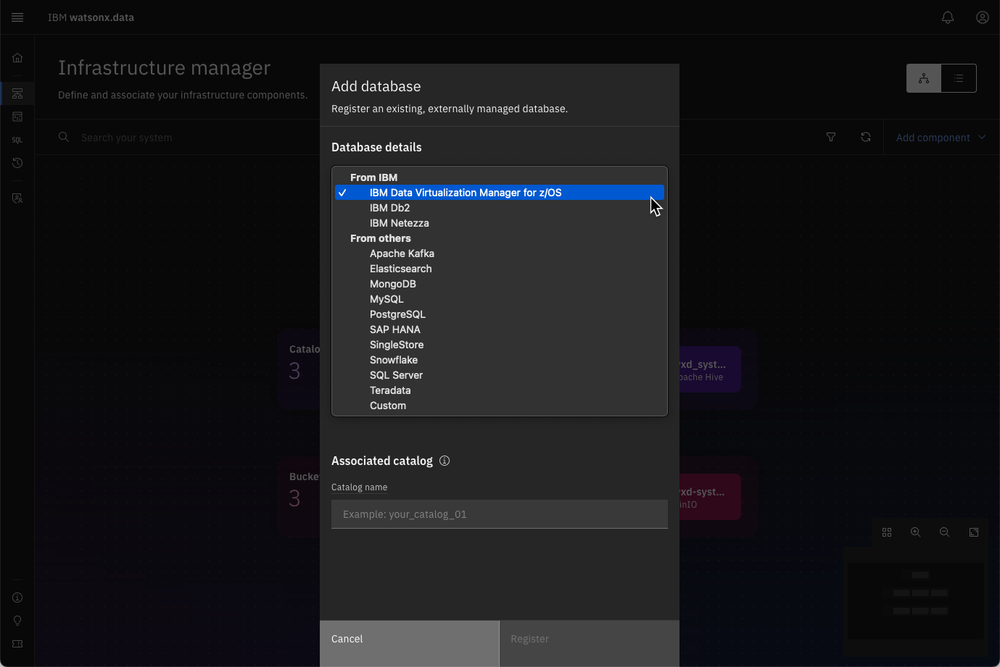

# Infrastructure Manager

The Infrastructure manager page opens with a graphical canvas view of the different infrastructure components currently defined in this watsonx.data environment. 

Before describing the contents of the UI, some explanation of the watsonx.data objects are necessary. Watsonx.data is based on open-source Presto DB, a distributed query engine that enables querying data stored in open file formats using open table formats for optimization and performance. There are four types of objects that are commonly referred to in the Presto DB environment:

* **Engine** – Each watsonx.data installation has at least one Presto DB engine which is used for querying the data. An installation can have more than one Presto engine to improve performance, isolate workloads, or test different versions. Additional engines can include Apache Spark, which provides capabilities for reading and transforming many types of data.
* **Catalogs** – Catalogs contain information about tables, files, and objects that are found in databases or file systems. Catalogs can be specific to the type of object being manipulated (Apache Hive, Apache Iceberg).
* **Buckets** – Buckets refer to Cloud Object Storage (MinIO, AWS S3, IBM COS, etc...) that contain the files and objects that you will catalog and eventually query with an engine.
* **Database** – These represent 3rd party databases that are used to query tables that are in a vendor’s proprietary format (Oracle, Db2, Netezza, etc...).

There are two built-in catalogs provided with watsonx.data:

* **Hive_data** – This catalog contains references to objects that are immutable. These are objects such as CSV (comma-separated values), Text, JSON, and Apache Parquet files which are read-only. 
* **Iceberg_data** – This catalog contains references to tables that are in Apache Iceberg format. These tables are optimized for space usage and query performance and can be updated.

Now that you know what the various components are, we can look at the information found in the Infrastructure manager.

## Infrastructure Manager UI

The Infrastructure manager page opens with a graphical canvas view of the different infrastructure components currently defined in this watsonx.data environment. 

!!! abstract "Click on the Infrastructure icon on the left side of the screen "

 

The Infrastructure manager provides a helpful visualization of the current system. 

 

These components are:

* Engines (blue layer) – The query engines that will access the data.

* Catalogs (purple layer) – Catalogs contain metadata about the objects found in buckets or databases. Each catalog is associated with one or more engines. An engine can’t access data in a bucket or a remote database unless the corresponding catalog is associated with the engine.

* Buckets (green layer) – An object-store that contains data (i.e., MinIO, AWS S3, Cloud-Object Storage). Each bucket is associated with a catalog (with a 1:1 mapping). When a bucket is added to watsonx.data, a catalog is created for it at the same time, based on input from the user. 

* Databases (blue layer) – Specialty Database engines. If a database connection is added (for federation purposes), a catalog is created for that database connection as well. 

The diagram can become complex as the number of data sources and engines increases. You can use the magnifier in the bottom right corner to fit the diagram onto the screen or to focus in on a portion of the diagram.

 

You have the option of auto-arranging, zooming in, zooming out, or fitting the diagram to the screen. 

!!! abstract "Click on the Zoom out (-) button and then Zoom in (+)"

The following is an example of a complex system where the diagram was fit to the screen.

 

You can also use your mouse to click on part of the screen and “move” it to center the diagram. To reduce the objects on the screen, you can filter them by object type using the filter icon:

 

!!! abstract "Filter by Catalogs to view the three that exist in the system"

 

To reset the screen back to the full diagram, choose reset in the filter dialog.

!!! abstract "Reset the Filters"

You can view the Infrastructure diagram as table by selecting the list view icon at the top right of the screen.

!!! abstract "Select List View"

 
 
Selecting the list icon will display the system as a table with a separate tab for Engines, Catalogs, Buckets, and Databases.

!!! abstract "Click on each tab in the table view to see the contents"

Reset back to the topology view.
 
!!! abstract "Switch back to topology view to the show the entire diagram"

## Exploring the Contents of a Catalog or Bucket

!!! abstract "Hover your mouse over the hive_data catalog"

As you hover your mouse over the hive_data catalog in the topology view, the elements (engine, catalogs, buckets, databases) that are connected will be highlighted on the screen.
 

To explore the contents of the hive_data catalog, click on the catalog icon. 

!!! abstract "Click on the hive_data catalog icon"

 
Detailed information about the catalog is displayed on the screen. There are additional tabs at the top of the screen that provide information on the data objects that are cataloged and the access control for those objects.

!!! abstract "Click on the Data Objects tab"

The Data Objects tab provides detailed information on the contents of the catalog. This provides an easy way to explore the contents of the catalog.
 
!!! abstract "Click on the Access Control Tab"

To close this dialog, press the [x] in the top right corner of the list. 

!!! abstract "Close the dialog by pressing the [x] in the corner"

You should now see the topology view of the system.

## Adding Resources to watsonx.data

To view how engines, buckets, and databases can be added, click on the Add component on the top right of the Infrastructure screen and select Create Engine.

!!! Abstract "Select Add component -> Database"

A dialog will appear that provides options for adding another bucket or database to the system. A production version of watsonx.data would also include an option for adding another compute engine to the system.

 
The Database Type drop-down menu supports a number of databases.

!!! Abstract "Select the database type drop-down"

The watsonx.data UI supports many types of databases that can be cataloged in the system. This list continues to expand with every release of the product.

!!! Abstract "Press Cancel to return to the Infrastructure Screen"

## Summary
The Infrastructure view provides a way to visualize the topology of the watsonx.data system. The topology includes: 

* Engines (blue layer) – The query engines that will access the data.
* Catalogs (purple layer) – Catalogs contain metadata about the objects found in buckets or databases.
* Buckets (green layer) – An object-store that contains data (i.e., MinIO, AWS S3, Cloud-Object Storage).
* Databases (blue layer) – Specialty Database engines.

The Infrastructure view allows an administrator to add Engines, Catalogs, Buckets, and Databases to the system. In addition, the individual objects can be selected to view the definition, contents, and access control.