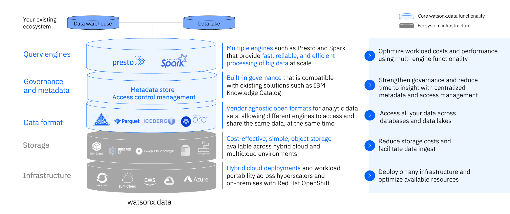

# Introducing watsonx.data 
Watsonx.data is a core component of watsonx, IBM’s enterprise-ready AI and data platform designed to multiply the impact of AI across an enterprise’s business.
The watsonx platform comprises three powerful components: the watsonx.ai studio for new foundation models, generative AI, and machine learning; the watsonx.data fit-for-purpose data store that provides the flexibility of a data lake with the performance of a data warehouse; plus, the watsonx.governance toolkit, to enable AI workflows that are built with responsibility, transparency, and explainability.

The watsonx.data component (the focus of this lab) makes it possible for enterprises to scale analytics and AI with a data store built on an open lakehouse architecture, supported by querying, governance, and open data and table formats, to access and share data. With watsonx.data, enterprises can connect to data in minutes, quickly get trusted insights, and reduce their data warehouse costs.

The next-gen watsonx.data lakehouse is designed to overcome the costs and complexities enterprises face. This will be the world’s first and only open data store with multi-engine support that is built for hybrid deployment across your entire ecosystem.
 
   * Watsonx.data is the only lakehouse with multiple query engines allowing you to optimize costs and performance by pairing the right workload with the right engine.
   * Run all workloads from a single pane of glass, eliminating trade-offs with convenience while still improving cost and performance.
   * Deploy anywhere with full support for hybrid-cloud and multi cloud environments.
   * Shared metadata across multiple engines eliminates the need to re-catalog, accelerating time to value while ensuring governance and eliminating costly implementation efforts.

This lab uses the watsonx.data developer package. The Developer package is meant to be used on single nodes. While it uses the same code base, there are some restrictions, especially on scale. 

We organized this lab into a number of sections that cover many of the highlights and key features of watsonx.data.

   * Requesting an IBM userid
   * Accessing the Environment
   * Introduction to watsonx.data
   * Watsonx.data UI Navigation
   * Infrastructure Manager
   * Data Manager
   * Query Workspace
   * Time Travel
   * Federation
   * SQL Examples

## Watsonx.data Developer Image 

The watsonx.data system is running on a virtual machine with the following resources:

   * 4 vCPUs
   * 16Gb of memory
   * 400Gb of disk

This is sufficient for running this exercises found in this lab but should not be used for performance testing or dealing with large data sets.