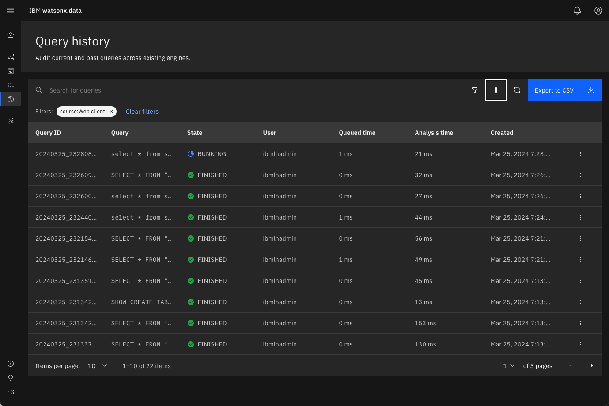
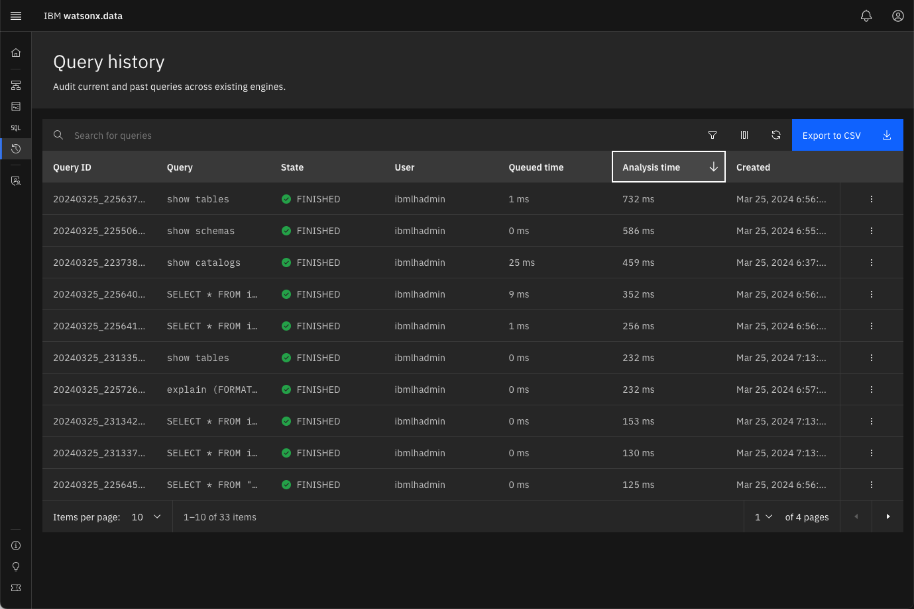
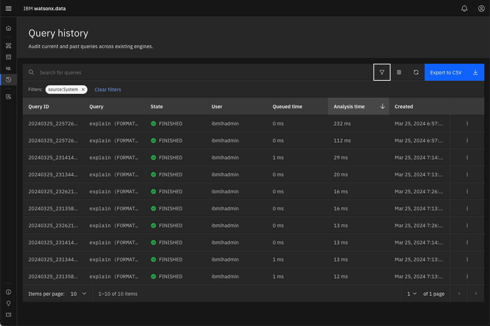
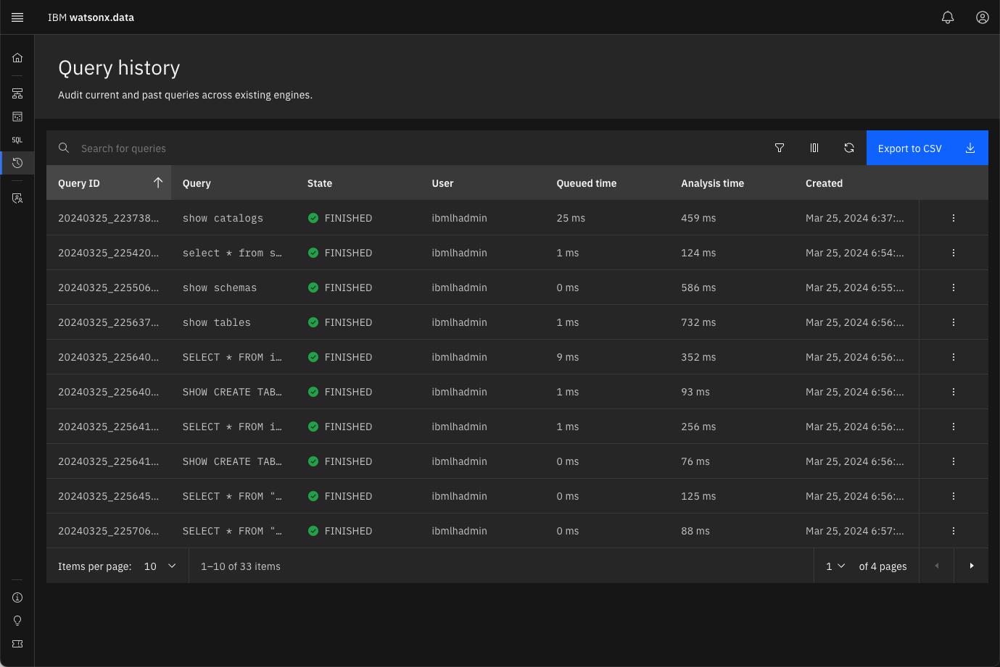
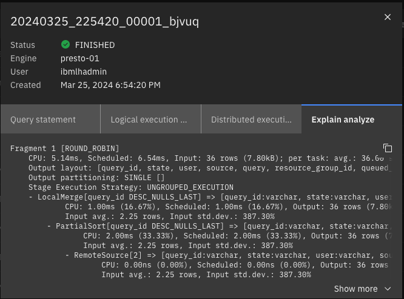

# Query History

The Query History page displays the list of queries that were run while the Presto engine was running. It includes SQL that was run by a user along with SQL that was run by the watsonx.data UI to populate the values in the dialog.

!!! abstract "Click on the Query History icon on the left side of the screen "

 

The Query History dialog provides a list of all SQL statements sorted by creation time.

 

The table contains the following columns:

* Query ID - The unique query ID assigned to the SQL statement
* Query - The SQL text that was executed
* State - What the statement is currently doing (Finished, Running)
* Engine - What engine the query was executed on
* User - The user that submitted the query
* Source - Where the query was initiated from 
* Created - Creation date and time of the query

There are two additional columns which are not displayed:

* Queued time - The amount of time the query waited to execute
* Analysis time - The amount of time it took to optimize the query

The columns that are displayed can be adjusted by using the customize option at the top of the query list.

 

!!! abstract "Remove Engine and Source and Add Queued and Analysis Time"

 

You can further refine the list by clicking on individual columns to sort in ascending or descending order.

 

!!! abstract "Sort the results by Analysis time"

 

Additional filters are available by pressing the filter button above the query list.

 

!!! abstract "Filter by the Source being the System"

If you find a query that you want to see more details on, click on the kebab symbol at the end of the line &vellip;

You have the choice of viewing the execution plan of the query, or placing the query into the Query workspace. This provides a simple of way of retrieving SQL that you may have deleted from your Query workspace!

The execution plan may be useful to debug performance issues with a query. 

!!! abstract "Clear the filters (found at the top of the query list) and sort by Query ID"

!!! warning "Your screens will be different that the ones found in the lab"

!!! abstract "Find the first SQL statement in your list of queries and select the View Excecution Plan option"

The panel displayed will be similar to the following.

!!! abstract "Select the Query Statement tab"

The SQL statement that was executed is found here. It may be a system routine if you did not filter the queries by userid.

!!! abstract "Select the Logical Execution Details tab"

This panel provides the logical steps that the engine goes through to compute the answer set.

!!! abstract "Select the Distributed Execution Details" 

This panel provides information how the query is distributed among engines. 

!!! abstract "Select the Explain Analysis"

This panel provides details on the explain analysis (costs) of the various steps in executing the query.

* Query statement - The original SQL that was submitted to the engine
* Logical Execution - 
* Distributed Execution
* Explain Analyze

## Summary

In this lab you learned how to look at previous queries, examine the SQL that was executed, and view the explain plans that were generated by the Presto engine.

